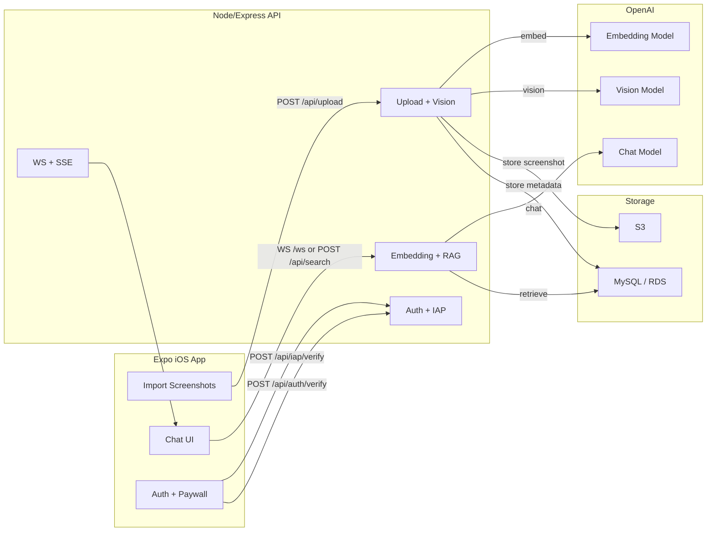

# Architecture

## Scope
This document describes how the iOS app, the API, and external services work together.

## System Overview
Nexus is an Expo iOS app backed by a Node/Express API. The API owns ingestion (vision + embeddings), retrieval (RAG), and streaming chat. Screenshots and metadata are stored in S3 + MySQL in production, with a local JSON + filesystem fallback for development.

## Key Components
- iOS App (Expo React Native)
  - Single-screen style app in `nexus/App.tsx`
  - Uploads screenshots, chats via WebSocket, manages paywall and Apple Sign In
- API Server (Node/Express)
  - `POST /api/upload` for screenshot ingestion
  - `POST /api/search` (HTTP) and `/ws` (WebSocket) for RAG chat
  - Apple Sign In verification and IAP receipt validation
- Storage
  - MySQL (RDS) for docs, categories, entitlements, usage
  - S3 for screenshot binaries
- External AI
  - OpenAI vision model for captioning + text extraction
  - OpenAI embeddings for RAG
  - OpenAI chat model for answers

## Architecture Diagram

## Data Flows
### Upload and Index
1) App selects screenshots from the photo library.
2) App uploads via `POST /api/upload` with `x-nexus-user-id`.
3) Server validates image, optionally converts HEIC, runs vision + text extraction.
4) Server embeds combined text and stores metadata + categories.
5) Server writes image to S3 (production) or local filesystem (dev).

### Chat (RAG)
1) App opens a WebSocket to `/ws` or uses `POST /api/search`.
2) Server embeds the query, retrieves top-K docs by hybrid score.
3) Server streams an answer built only from retrieved context.
4) App renders streaming chunks and shows source screenshots.

### Auth + Paywall
- Apple Sign In: `POST /api/auth/verify` validates the identity token and returns a stable user ID.
- Paywall: usage is tracked daily (messages) and total (uploads). API returns `402` with `code: PAYWALL_REQUIRED` when limits are exceeded.
- IAP: receipts are verified via Apple and entitlements are persisted server-side.

## Google Auth + Drive Folder RAG (Separate Scope)
Drive Chat is a parallel, Google-only experience that does not reuse screenshot categories or threads.

### Google Auth
- App uses Expo AuthSession to obtain a Google auth code and exchanges it for an access token.
- Server verifies the Google access token via `POST /api/auth/verify` with `provider: "google"` and issues a Nexus user ID.
- The Google access token is sent to Drive endpoints via `Authorization: Bearer <token>` (or `x-google-access-token`).

### Drive Folder RAG
- Folder selection is required: users paste a Drive folder link or browse their Drive.
- `POST /api/drive/resolve-link` resolves the link and rejects non-folder links.
- `GET /api/drive/folders/:id` lists subfolders and eligible files (Docs/PDF/plain text only).
- Chat runs over WebSocket `/ws` with `type: "drive_search"` and includes `query`, `folderId`, `accessToken`, `userId`, and `model`.
- The server fetches up to 50 files, extracts text on-demand, embeds, retrieves, and streams an answer.
- Citations include file name and link (no snippet offsets stored).
- Drive chat history is not persisted; it resets on app launch.

## API Surface (Core)
- `GET /api/health` - health + DB/S3 config
- `POST /api/upload` - screenshot ingestion (multipart)
- `GET /api/docs` - list indexed screenshots
- `GET /api/categories` - category summary
- `POST /api/search` - RAG answer (HTTP)
- `POST /api/search-stream` - RAG streaming (SSE)
- `WS /ws` - RAG streaming (WebSocket)
- `POST /api/auth/verify` - Apple + Google Sign In
- `POST /api/iap/verify` - IAP receipt verification
- `POST /api/drive/resolve-link` - resolve Drive folder link (Google only)
- `GET /api/drive/folders/:id` - list Drive folders/files (Google only)

## Data Model (Server)
- users: id, provider, providerSub, email, displayName
- docs: id, userId, caption, text, embedding, storage, file path / S3 key
- categories + doc_categories: normalized category mapping
- entitlements: plan, status, expiresAt, source
- usage_daily + usage_totals: paywall counters

## Notable Constraints
- Uploads are screenshots only (no videos).
- Chat scope is required (category or specific screenshot).
- Category fan-out per screenshot is capped (`MAX_CATEGORIES_PER_DOC`).
